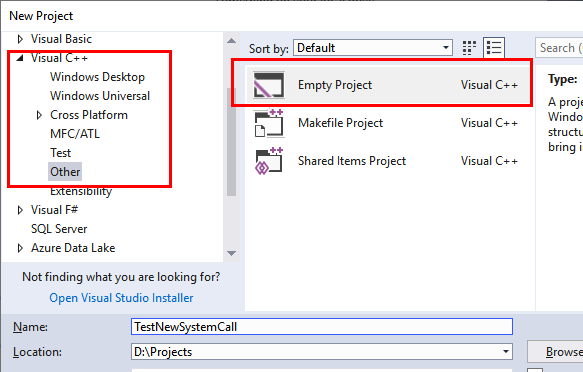
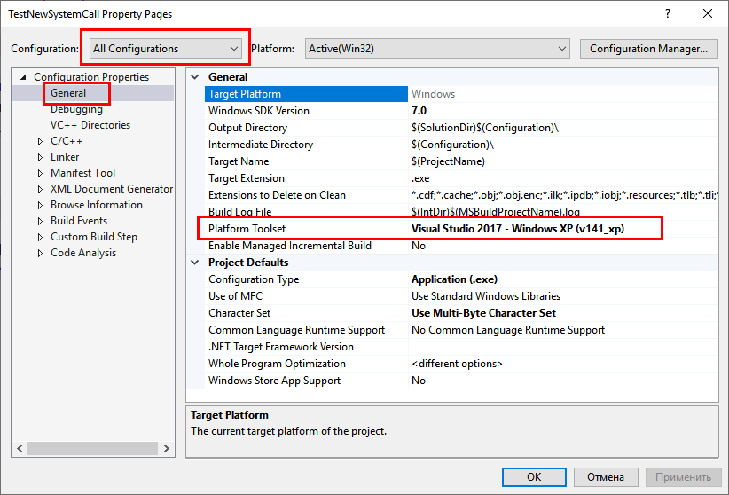
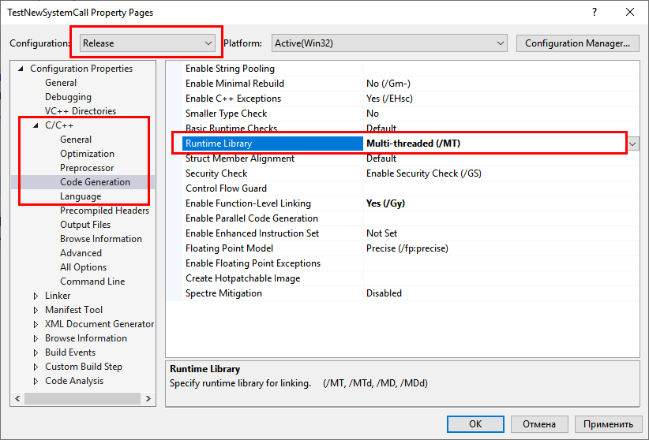
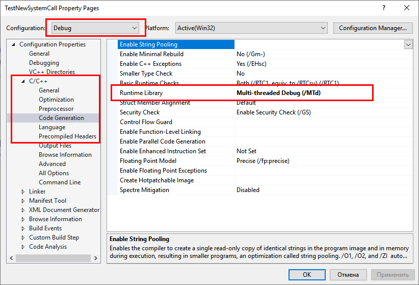
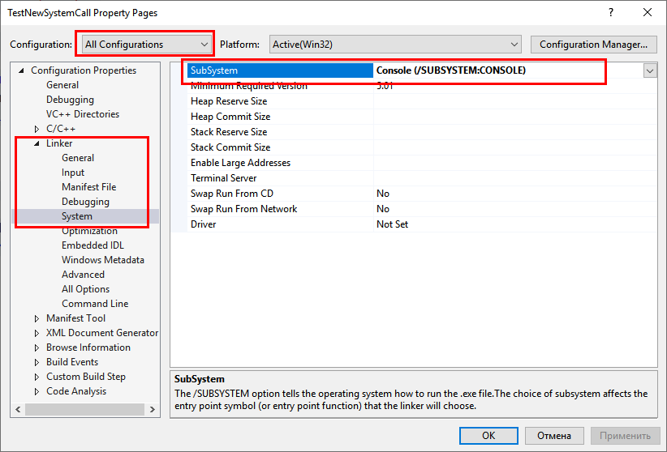
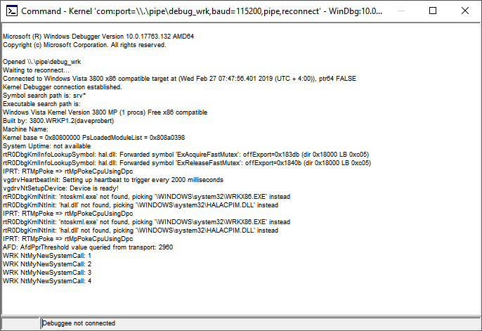

# 01. Создание собственного сервиса ядра

## Цель
- изучить механизм диспетчеризации сервисов ядра
- научиться добавлять собственный сервис, включая:
    - функцию сервиса
    - строки в таблицах диспетчеризации
- научиться вызывать сервисы ядра напрямую (минуя стандартные обертки из ntdll.dll)

## Материалы для изучения
- [Howto: Implementation of new system service calls (I)](https://www.dcl.hpi.uni-potsdam.de/research/WRK/2007/07/howto-implementation-of-new-system-service-calls/)
- [Howto: Implementation of new system service calls (II)](https://www.dcl.hpi.uni-potsdam.de/research/WRK/2007/07/howto-implementation-of-new-system-service-calls-ii/)
- [Howto: Implementation of new system service calls (III)](https://www.dcl.hpi.uni-potsdam.de/research/WRK/2008/03/howto-implementation-of-new-system-service-calls-iii/)
- [WRK System Service Calls Made Simple](https://www.dcl.hpi.uni-potsdam.de/research/WRK/2009/03/implementation-of-a-new-system-service-call-2009-update/)

## Необходимые нструменты
- пакет WRK
- виртуальная машина c Windows 2003 
- пакет Windows Debugging Tools
- утилита systablegen с сайта [https://wrktools.codeplex.com](https://archive.codeplex.com/?p=wrktools). Её также можно найти в папке **Resources\\wrktools\\systablegen**
- Visual Studio 2017 с установленной поддержкой сборки C++ программ для Windows XP

## Задание 1. Создание простого сервиса без параметров
В этом задании нужно будет: 
- добавить новую процедуру в модуль исполнительной подсистемы (с префиксом Nt)
- сделать её доступной из пользовательского кода (дополнить таблицу деспетчеризации системных вызовов)
- убедиться в её работоспособности, для чего сделать простое консольное приложение, обращающееся к этому сервису напрямую

### Добавление новой процедуры
1. Перейдите в папку WRK **Resources\\WRK\\WRK-v1.2\\base\\ntos\\ex**
2. Создайте в ней файл с именем **mycall.c** 
3. Добавьте в файл следующий текст:

```C++
#include "exp.h"

NTSTATUS NtMyNewSystemCall()
{
	static long callCount = 0;
	DbgPrint("WRK NtMyNewSystemCall: %d\n", ++callCount);
	return STATUS_SUCCESS;
}
```

4. Откройте в Visual Studio файл солюшена для WRK и добавьте файл в проект WRK
5. Перейдите в папку **Resources\WRK\WRK-v1.2\base\ntos\ex\BUILD** и откройте файл **makefile**
6. Перейдите к обявлению сборки 
```makefile
ccobjs= \
	$(OBJ)\callback.obj		\
	$(OBJ)\callperf.obj		\
	$(OBJ)\delay.obj		\
	$(OBJ)\event.obj		\
...
```
7. Поменяйте последнюю строку этого объявления и добавьте новую с объектным файлом для добавленного вами сервиса:
```makefile
ccobjs= \
	$(OBJ)\callback.obj		\
	$(OBJ)\callperf.obj		\
	$(OBJ)\delay.obj		\
	$(OBJ)\event.obj		\
...

	$(OBJ)\rundown.obj		\
	$(OBJ)\pushlock.obj		\
	$(OBJ)\keyedevent.obj		\
	$(OBJ)\mycall.obj
```

8. Запустите компиляцию и убедитесь что она прошла без ошибок


### Обновление таблиц диспетчера системных вызовов
1. Перейдите в папку **Resources\\WRK\\WRK-v1.2\\base\\ntos\\ke\\i386** и откройте файл **services.tab**
2. Перейдите в конец файла и добаьте в него строку **MyNewSystemCall,0** (формат строки _<Имя_системного_сервиса_без_префикса>,<число_параметров>_). 
```
...
WaitForKeyedEvent,4
QueryPortInformationProcess,0
GetCurrentProcessorNumber,0
WaitForMultipleObjects32,5
MyNewSystemCall,0
```

Сохраните и закройте файл

3. Запустите в этой же папке утилиту **Resources\tools\wrktools\systablegen\mksystbl.exe**. Обратите внимание, что изменились файлы **sysstubs.asm** и **systable.asm**
4. Запустите сборку WRK еще раз

### Создание тестового приложения
1. Откройте **Visual Studio** и создайте новый пустой проект C++ (Visual С++\Other\Empty Project)



2. Добавьте в проект файл **main.c** следующего содержания:
```C
#include <windows.h>

NTSTATUS NtMyNewSystemCall()
{
	__asm {
		mov eax, 296
		int 0x2E
	}
}

int main()
{
	NtMyNewSystemCall();
	return 0;
}
```

3. Откройте настройки проекта и переведите его на компиляцию для Windows XP без зависимых библиотек (статическая сборка). Для этого:

- на закладке **General** для конфигурации **All Configurations** измените значение параметра **Platform Toolset** на **Visual Studio 2017 - Windows XP (v141_xp)**



- на закладке **C/C++\Code Generation** измените параметр **Runtime Library**:
    - для конфигурации **Release** на **Multi-threaded (/MT)**
    - для конфигурации **Debug** на **Multi-threaded Debug (/MTd)**

**Release**


**Debug**


- на закладке **Linker\System** для параметра **SubSystem** выберите **Console (/SUBSYSTEM:CONSOLE)** для всех конфигураций



4. Запустите виртуальную машину с Windows 2003, перенесите на неё скомпилированное ядро и тестовую программу
5. Запустите WinDbg для отладки ядра и перезагрузите виртуальную машину с ядром WRK (в режиме отладки)
6. Убедитесь, что отладчик подключился к удаленному ядру, залогиньтесь на машине и несколько раз запустите тестовое приложение. Проверьте, что в окне отладчика появились сообщения от вашеей 




## Задание 2. Сервис с параметром

Доработайте созданный в Задании 1 сервис, так, чтобы он принимал на  вход 1 числовой параметр и выдавал столько отладочных сообщений, сколько указано в параметре. 

В качестве базы можно взять пример из статей в материалах для изучения.

## Задание 3 (исследовательское, необязательное). Получение и передача произвольных параметров в/из сервисы(ов) ядра

- Изучите и сформулируйте правила передачи параметров в/из ядра Windows (на основе других сервисов)
- Добавьте еще один или несколько сервисов, демонстрирующих различные варианты передачи и получения данных из ядра