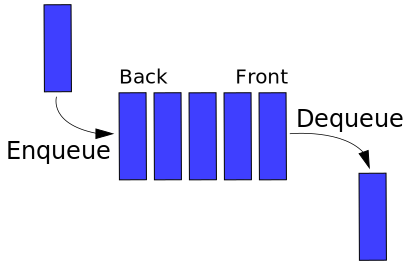

# Queue

**Queue** is a collection in which the entities in the collection are kept in order and the principal (or only) operations on the collection are the addition of entities to the rear terminal position, known as _enqueue_, and removal of entities from the front terminal position, known as _dequeue_



# [C# Sample](#tab/tab1)

[!code[Sample](../samples/queue_sample.cs?range=8-19&highlight=2)]

# [VB Sample](#tab/tab2)
```VB
Dim numbers As New Queue(Of String)
numbers.Enqueue("one")
numbers.Enqueue("two")
numbers.Enqueue("three")
numbers.Enqueue("four")
numbers.Enqueue("five")

' A queue can be enumerated without disturbing its contents.
For Each number As String In numbers
    Console.WriteLine(number)
Next
```
***

# [C# Sample](#tab/tab1)
[!code[Sample](../samples/queue_sample.cs?name=Sample2)]

# [VB Sample](#tab/tab2)
[!code[Sample](../samples/queue_sample.vb?name=Sample2)]
***